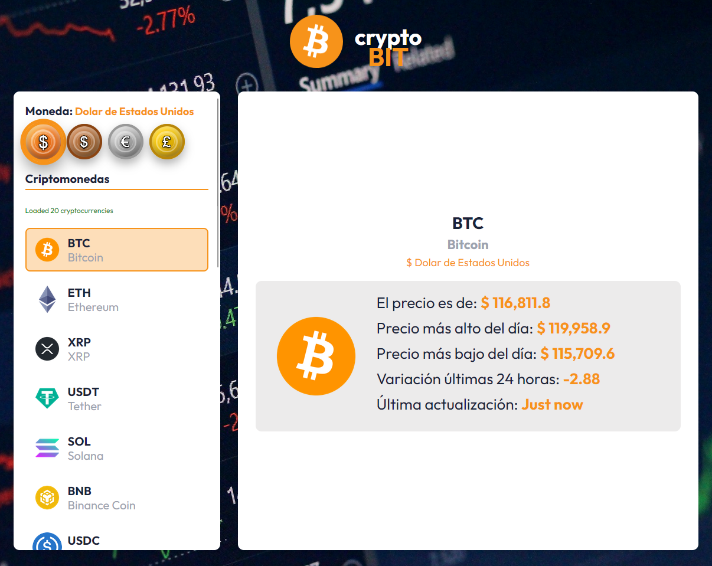
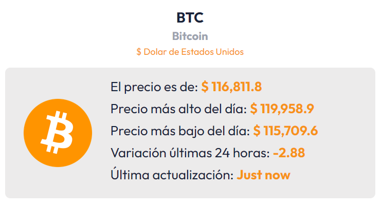
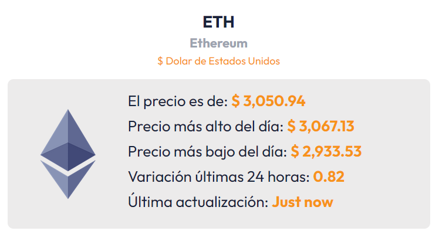
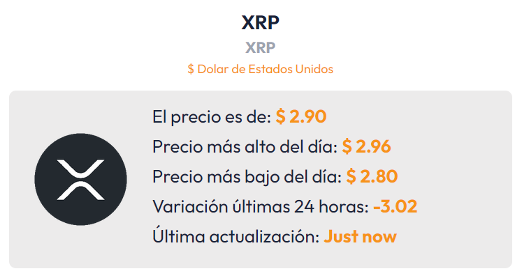
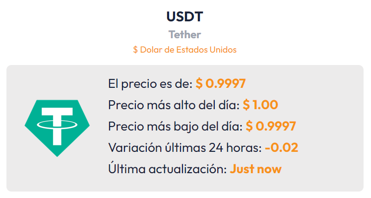
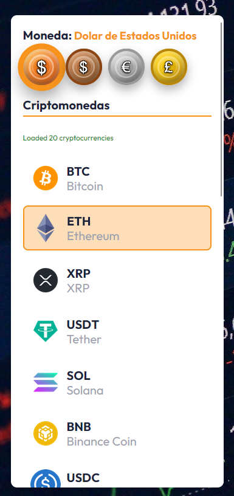

<div align="center">


# CryptoBIT


[](https://reactjs.org/)
[](https://www.typescriptlang.org/)
[](https://vitejs.dev/)
[](https://zustand-demo.pmnd.rs/)

A modern and responsive web application for real-time cryptocurrency price tracking. Built with **React**, **TypeScript** and a user-centered design approach.

# [🚀 Live Demo](https://cryptobit2.netlify.app/) <!-- Add your deployment URL here -->
</div>

## 🌟 Features

- 📱 **Responsive Design** - Optimized for desktop, tablet and mobile
- ⚡ **Real-Time Data** - Live cryptocurrency price updates
- 🎨 **Modern UI** - Coin-style buttons with visual effects
- 💱 **Multiple Currencies** - Support for USD, EUR, GBP and MXN
- 🔍 **Intuitive Search** - Sidebar with popular cryptocurrency list
- 🎯 **Default Selection** - USD/BTC preselected for better UX
- 🌙 **Visual Effects** - Smooth animations and fluid transitions

## 📸 Screenshots
---
<p align="center">
  
  




</p>


## 🛠️ Tech Stack

### Frontend
- **React 18** - JavaScript library for building user interfaces
- **TypeScript** - Static typing for JavaScript
- **React Router** - Navigation and routing
- **Vite** - Fast development build tool
- **CSS Grid & Flexbox** - Modern responsive layout

### State Management & Data
- **Zustand** - Lightweight and efficient state management
- **Zod** - TypeScript-first schema validation
- **Axios** - HTTP client for API requests

### External API
- **CryptoCompare API** - Real-time cryptocurrency data

### Development Tools
- **ESLint** - Code linting
- **PostCSS** - CSS processing
- **Autoprefixer** - Cross-browser CSS compatibility

## 🏗️ Installation & Setup

### Prerequisites
- Node.js (version 16 or higher)
- npm or yarn

### Installation Steps

1. **Clone the repository**
   ```bash
   git clone https://github.com/firedevelop/cryptoBIT.git
   cd cryptoBIT
   ```

2. **Install dependencies**
   ```bash
   npm install
   ```

3. **Run in development mode**
   ```bash
   npm run dev
   ```

4. **Open in browser**
   ```
   http://localhost:5173
   ```

## 📦 Available Scripts

| Command | Description |
|---------|-------------|
| `npm run dev` | Starts the development server |
| `npm run build` | Builds the app for production |
| `npm run lint` | Runs code linter |
| `npm run preview` | Preview production build |

## 🏛️ Project Architecture

```
src/
├── components/          # Reusable React components
│   ├── CriptoSearchForm.tsx    # Search and selection form
│   ├── CryptoPriceDisplay.tsx  # Price display component
│   ├── ErrorMessage.tsx        # Error handling
│   ├── Footer.tsx             # Footer component
│   └── Spinner.tsx            # Loading indicator
├── pages/               # Application pages
│   ├── Home.tsx               # Main cryptocurrency app
│   └── Credits.tsx            # Credits and acknowledgments
├── data/               # Static data (supported currencies)
├── schema/             # Zod validation schemas
├── services/           # API services
├── types/              # TypeScript definitions
├── store.ts            # Global state with Zustand
├── index.css           # Global styles
└── main.tsx            # Application entry point
```

## 🎨 Design Features

### Color System
- **Primary**: `#F7931A` (Bitcoin Orange)
- **Secondary**: `#182339` (Black)
- **Background**: `#FFFFFF` (White)
- **Accents**: `#9CA3AF` (Medium Gray)

### Key Components

#### 🪙 Currency Buttons
- Coin-style design with 3D effects
- Custom gradients per currency
- Hover and selection animations
- Realistic shadows with inset effects

#### 📱 Responsive Design
- **Desktop**: 2-column grid (sidebar + content)
- **Tablet**: Stacked layout with condensed sidebar
- **Mobile**: Small screen optimization

## 🔧 API Configuration

The application uses the free CryptoCompare API:
- **Main Endpoint**: `https://min-api.cryptocompare.com/`
- **Limit**: Top 20 cryptocurrencies
- **Updates**: Real-time data

## 🚀 Deployment

### Vercel (Recommended)
```bash
npm run build
vercel --prod
```

### Netlify
```bash
npm run build
netlify deploy --prod --dir=dist
```

### GitHub Pages
```bash
npm run build
npm run deploy
```

## 🤝 Contributing

Contributions are welcome! For major changes:

1. Fork the project
2. Create your feature branch (`git checkout -b feature/AmazingFeature`)
3. Commit your changes (`git commit -m 'Add some AmazingFeature'`)
4. Push to the branch (`git push origin feature/AmazingFeature`)
5. Open a Pull Request

## 📝 Roadmap

- [ ] 🌙 Dark/Light mode toggle
- [ ] 📊 Historical price charts
- [ ] 🔔 Price alerts
- [ ] 💾 Persistent favorites
- [ ] 🌍 Internationalization (i18n)
- [ ] 📈 Basic technical analysis

## 📄 License

This project is licensed under the MIT License.

# Credits

### logo.svg
Logo License: Bitcoin (BTC)
Commercial use: Allowed
Personal use: Allowed
Modification: Allowed
Redistribution: Allowed
Exclusive rights: Not granted
Credit: Not required
Attribution: Not required
License type: Public domain / Open-source
https://cryptologos.cc/bitcoin


### bg.jpg
Foto de <a href="https://unsplash.com/es/@polarmermaid?utm_content=creditCopyText&utm_medium=referral&utm_source=unsplash">Anne Nygård</a> en <a href="https://unsplash.com/es/fotos/interfaz-grafica-de-usuario-aplicacion-x07ELaNFt34?utm_content=creditCopyText&utm_medium=referral&utm_source=unsplash">Unsplash</a>
           
### CryptoCompare
---
#### Atribución de Datos

Los datos utilizados en este proyecto/aplicación se obtienen de la API gratuita de CryptoCompare.

Agradecemos a CryptoCompare por proporcionar esta información.

**Licencia de Uso:**

Esta aplicación utiliza datos bajo la licencia **Creative Commons Atribución-NoComercial-CompartirIgual 4.0 Internacional (CC BY-NC-SA 4.0)**.

Puedes encontrar más información sobre CryptoCompare y sus términos de API en:
* **Sitio web de CryptoCompare:** [https://www.cryptocompare.com/](https://www.cryptocompare.com/)
* **Acuerdo de Licencia de API:** [https://www.cryptocompare.com/api-licence-agreement/](https://www.cryptocompare.com/api-licence-agreement/)

---

## 🙏 Acknowledgments

- [CryptoCompare](https://cryptocompare.com/) for the data API
- [React](https://reactjs.org/) for the framework
- [Vite](https://vitejs.dev/) for the development tool
- Open source community for the libraries used

---

⭐ **If this project was helpful, consider giving it a star!** ⭐